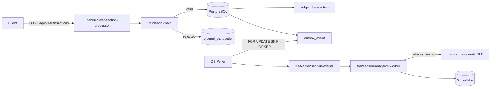

# Architecture

## Consistency and delivery
- Ledger + outbox are one ACID transaction.
- Polling is horizontally safe through PostgreSQL row locking with `SKIP LOCKED`.
- Outbox -> Kafka is at-least-once.
- Snowflake `MERGE` by `EVENT_ID` makes downstream handling idempotent.
- Rejected requests are retained in a separate audit table with stable error codes.
