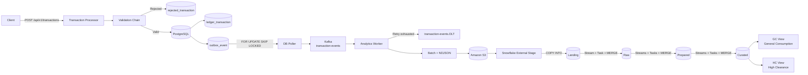

# Architecture

## 1. End-to-End Architecture

The solution uses a transactional outbox for reliable event publication and a file-based analytics ingestion boundary before Snowflake.



The final analytics flow is:

```text
HTTP
 -> PostgreSQL Ledger + Outbox
 -> DB Poller
 -> Kafka
 -> Analytics Worker
 -> Batched NDJSON
 -> Amazon S3
 -> Snowflake Landing
 -> Raw
 -> Prepared
 -> Curated
 -> GC / HC consumption views
```

---

## 2. Transaction Processing and Transactional Outbox

The transaction processor owns the synchronous transactional boundary.

```text
HTTP Request
     |
     v
Validation Chain
     |
     +---- invalid ----> rejected_transaction
     |
    valid
     |
     v
@Transactional
     |
     +---- ledger_transaction
     |
     +---- outbox_event
```

The ledger transaction and its corresponding outbox event are persisted in the same PostgreSQL ACID transaction.

This avoids a database/Kafka dual-write problem.

The DB poller reads eligible outbox rows in batches using:

```sql
FOR UPDATE SKIP LOCKED
```

This allows multiple poller instances to safely share work.

### Delivery Semantics

Outbox-to-Kafka delivery is **at-least-once**.

Duplicate delivery is therefore expected, and downstream processing must be idempotent.

---

## 3. Kafka Analytics Worker

The analytics worker consumes transaction events from Kafka and persists them to S3.

```text
Kafka
  |
  v
Analytics Worker
  |
  +-- Deserialize
  +-- Validate
  +-- Retry
  +-- DLT for poison events
  +-- Batch events
  |
  v
NDJSON file
  |
  v
Amazon S3
```

The analytics worker does **not** directly write to Snowflake.

Its responsibility ends after the batch is successfully persisted to S3.

### Batching

Events are flushed based on:

- maximum record count
- maximum flush interval

This avoids creating one S3 object per Kafka event while ensuring low-volume events are not retained indefinitely in memory.

Example object path:

```text
banking-transactions/
  year=2026/
    month=09/
      day=05/
        hour=13/
          transactions-<timestamp>-<uuid>.json
```

Example NDJSON:

```json
{"eventId":"...","transactionId":"txn-1001","amount":100.00}
{"eventId":"...","transactionId":"txn-1002","amount":250.00}
{"eventId":"...","transactionId":"txn-1003","amount":500.00}
```

For reliable delivery, Kafka offsets should only be acknowledged after the corresponding batch has been durably uploaded to S3.

---

## 4. Why S3 Is the Analytics Integration Boundary

S3 separates the event-processing application from the analytical platform.

Benefits include:

- durable replay source
- decoupling Kafka consumers from Snowflake availability
- controlled file batching
- easier operational recovery
- auditable source files
- support for bulk-oriented Snowflake loading
- reduced direct dependency between Java code and Snowflake

If Snowflake is unavailable, source files remain in S3 and can be loaded later without requesting the source application to regenerate data.

---

## 5. Snowflake Data Platform

Once data has been persisted to S3, Snowflake becomes responsible for ingestion, transformation, modeling and analytical consumption.

```text
Amazon S3
    |
    v
External Stage
    |
    v
COPY INTO
    |
    v
Landing
    |
    v
Raw
    |
    v
Prepared
    |
    v
Curated
```

Snowflake-native processing is preferred once the data enters the platform, avoiding unnecessary extraction back into Java services.

---

## 6. Snowflake Data Layers

### 6.1 Landing

**Purpose**

- ingestion boundary
- preserve source representation
- support replay and troubleshooting
- capture ingestion metadata

Typical structure:

```text
PAYLOAD VARIANT
SOURCE_FILE
SOURCE_ROW_NUMBER
LOAD_TIMESTAMP
```

Landing data is kept close to the source format with minimal transformation.

---

### 6.2 Raw

**Purpose**

- convert semi-structured payloads into typed columns
- deduplicate events
- retain technical history
- apply basic technical data-quality rules

Example columns:

```text
EVENT_ID
TRANSACTION_ID
LEDGER_ID
AMOUNT
CURRENCY
SETTLEMENT_DATE
STATUS
OCCURRED_AT
SOURCE_FILE
LOAD_TIMESTAMP
```

Landing-to-Raw processing is performed using Snowflake-native SQL and `MERGE`.

`EVENT_ID` and business identifiers provide replay-safe idempotency.

---

### 6.3 Prepared

**Purpose**

Prepared contains reusable enterprise models rather than source-specific structures.

Typical objects can include:

```text
DIM_ACCOUNT
FACT_TRANSACTION
BRIDGE_TRANSACTION_ACCOUNT
```

This layer is where:

- business relationships are modeled
- facts and dimensions are maintained
- reusable enterprise definitions are applied
- sensitive attributes can be protected before consumption

---

### 6.4 Curated

**Purpose**

Curated exposes business-oriented data products for downstream consumers.

Consumers can include:

- Business Intelligence
- reporting
- analytics
- data science
- downstream applications
- controlled data sharing

Curated models are optimized around consumption use cases rather than source-system structures.

---

## 7. Incremental Data Flow with Streams and Tasks

Snowflake Streams and Tasks are used for incremental processing.

```text
S3
 |
COPY INTO
 |
 v
Landing
 |
Landing Stream
 |
Landing -> Raw Task
 |
 v
Raw
 |
Raw Streams
 |
Raw -> Prepared Tasks
 |
 v
Prepared
 |
Prepared Stream
 |
Prepared -> Curated Task
 |
 v
Curated
```

### Stream

A Stream identifies **what data changed**.

### Task

A Task defines **when processing runs and what SQL is executed**.

Typical processing includes:

- `COPY INTO`
- `MERGE`
- incremental transformations
- fact updates
- dimension updates
- bridge updates
- curated aggregations

---

## 8. Security and RBAC

Snowflake security is based on roles and privileges.

Conceptually:

```text
User
  |
  v
Role
  |
  +-- Database access
  +-- Schema access
  +-- Table / View privileges
  +-- Row Access Policies
  +-- Masking Policies
```

Example roles:

```text
BANKING_PIPELINE_ROLE
BANKING_ANALYST_ROLE
BANKING_HIGH_CLEARANCE_ROLE
```

The design follows least-privilege principles.

Access is separated between:

- pipeline/service roles
- normal consumption roles
- privileged/high-clearance roles

Row access policies can restrict which rows a role is allowed to see, while masking policies can protect sensitive values at query time.

---

## 9. PII Protection and GC / HC Consumption Views

Sensitive information remains protected in the underlying/core data structures.

The consumption model is:

```text
Prepared / Core Tables
        |
        | Protected sensitive data
        |
        v
      Curated
        |
        +-----------------------------+
        |                             |
        v                             v
GC View                         HC View
General Consumption             High Clearance
        |                             |
Masked / protected PII          Authorized clear-text access
```

### GC — General Consumption

Used by normal analytical users.

PII remains masked, protected or encrypted according to the security policy.

### HC — High Clearance

Restricted to explicitly authorized roles.

Where the design requires explicit column-level encryption, Snowflake encryption/decryption functions can be used in conjunction with RBAC and secure views so that only privileged consumers can obtain the clear-text value.

The underlying/core table remains protected rather than storing an unrestricted clear-text copy for general use.

---

## 10. Metadata and Governance

Technical and business metadata should be managed independently from the physical pipeline.

An enterprise catalog such as Collibra, or another metadata repository, can hold:

```text
Dataset name
Business definition
Data owner
Technical owner
Source system
Schema
Column definitions
PII classification
Security classification
Refresh frequency
SLA
Retention policy
Quality rules
Lineage
```

This separates data governance concerns from pipeline execution.

### Responsibilities

**Data Architect**

- platform architecture
- data-layer design
- integration patterns
- scalability
- security architecture

**Data Modeler**

- dimensions
- facts
- bridge tables
- business entities
- relationships
- semantic consistency

**Data Governance**

- ownership
- classification
- PII identification
- access policy
- retention
- lineage
- quality standards

**Engineering Team**

- pipeline implementation
- testing
- deployment
- monitoring
- failure handling
- operational support

---

## 11. Data Quality and Reconciliation

Every stage should be reconcilable.

Example:

```text
Kafka events produced          10,000
        |
        v
S3 records                     10,000
        |
        v
Landing                        10,000
        |
        v
Raw accepted                    9,998
Raw rejected                        2
        |
        v
Prepared                        9,998
        |
        v
Curated                         9,998
```

Data-quality checks can include:

- mandatory business keys
- duplicate `EVENT_ID`
- invalid amount
- invalid currency
- invalid data types
- referential-integrity checks
- source-to-target record reconciliation

Invalid or rejected records must remain traceable and recoverable.

---

## 12. Lineage and Auditability

A curated transaction should be traceable back through the complete pipeline.

```text
Curated
   |
Prepared
   |
Raw
   |
Landing
   |
S3 object
   |
Kafka event
   |
Outbox event
   |
Ledger transaction
```

Useful lineage attributes include:

```text
EVENT_ID
TRANSACTION_ID
SOURCE_FILE
SOURCE_ROW_NUMBER
LOAD_TIMESTAMP
PROCESSING_TIMESTAMP
```

This supports audit, reconciliation, root-cause analysis and controlled replay.

---

## 13. Failure Handling and Recovery

### PostgreSQL Failure

No partial ledger/outbox transaction is committed.

Clients can safely retry using transaction identifiers and duplicate protection.

### Kafka / Poller Failure

Outbox records remain available for retry.

The ledger remains the transactional system of record.

### Analytics Worker Failure

Kafka retains uncommitted events.

Retries and DLT handling isolate transient and poison-message failures.

### S3 Failure

The Kafka batch must not be considered successfully persisted until the S3 upload completes.

Failed uploads are retried.

### Snowflake Load Failure

The S3 source file remains available.

Loading can therefore resume after Snowflake recovery without reproducing the source transaction.

### Transformation Failure

Snowflake Task history provides operational visibility.

Streams plus idempotent `MERGE` operations allow controlled retry and replay.

---

## 14. Performance and Cost

Important Snowflake considerations include:

- use appropriately sized virtual warehouses
- enable auto-suspend
- use auto-resume
- prefer incremental processing
- avoid unnecessary full-table scans
- isolate workloads where appropriate
- monitor warehouse and query consumption
- review clustering/pruning requirements as data volume grows

Streams and Tasks reduce repeated processing by operating on incremental changes.

---

## 15. Consumption and Interoperability

The Curated layer is the controlled data-product boundary.

Potential consumers include:

- BI tools
- data science platforms
- downstream applications
- secure data sharing
- Snowflake Marketplace use cases

The architecture also leaves room for interoperability with S3-based lakehouse technologies such as Apache Iceberg and platforms such as Databricks, instead of treating Snowflake as an isolated analytical system.

---

## 16. Reliability Model

The complete delivery chain is:

```text
HTTP
 |
 v
PostgreSQL Ledger + Outbox
 |
 | ACID
 v
DB Poller
 |
 | At-least-once
 v
Kafka
 |
 v
Analytics Worker
 |
 | Batch + retry
 v
S3
 |
 | Durable replay boundary
 v
Snowflake Landing
 |
 | Stream / Task / MERGE
 v
Raw
 |
 v
Prepared
 |
 v
Curated
 |
 +--> GC
 |
 +--> HC
```

The architecture combines:

- transactional consistency in PostgreSQL
- asynchronous delivery with Kafka
- durable file-based integration through S3
- replay-safe Snowflake ingestion
- layered data modeling
- incremental processing
- enterprise RBAC
- PII protection
- metadata governance
- lineage
- reconciliation
- operational recovery
- cost-aware analytical processing
